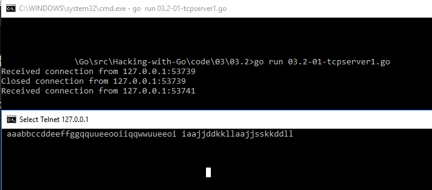
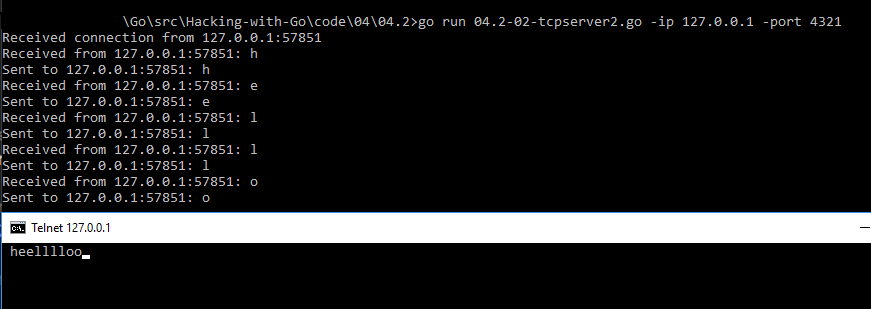

# 04.2 - TCP servers
Now we will create TCP and UDP servers.

<!-- MarkdownTOC -->

- [net.Listen](#netlisten)
    - [No logging with io.Copy\(\)](#no-logging-with-iocopy)
    - [Logging with extra goroutines](#logging-with-extra-goroutines)
- [net.TCPListen](#nettcplisten)
- [Lessons learned](#lessons-learned)

<!-- /MarkdownTOC -->


[net package overview][net-pkg-overview] also shows us how to create a generic TCP server. When creating a server we can take advantage of goroutines and spawn one for each connection.

<a name="netlisten"></a>
## net.Listen
The generic `net.Listen` method is capable of doing both TCP and UDP.

<a name="no-logging-with-iocopy"></a>
### No logging with io.Copy()
Building on the example from `net` package we can build a simple TCP server:

``` go
// 04.2-01-tcpserver1.go
package main

import (
    "flag"
    "fmt"
    "io"
    "net"
    "strconv"
)

var (
    bindIP   string
    bindPort int
)

func init() {
    flag.IntVar(&bindPort, "port", 12345, "bind port")
    flag.StringVar(&bindIP, "ip", "127.0.0.1", "bind IP")
}

// CreateAddress converts host and port to host:port.
func CreateAddress(target string, port int) string {
    return target + ":" + strconv.Itoa(port)
}

// handleConnectionNoLog echoes everything back without logging (easiest)
func handleConnectionNoLog(conn net.Conn) {

    rAddr := conn.RemoteAddr().String()
    defer fmt.Printf("Closed connection from %v\n", rAddr)

    // This will accomplish the echo if we do not want to log
    io.Copy(conn, conn)
}

func main() {

    flag.Parse()

    // Converting host and port
    t := CreateAddress(bindIP, bindPort)

    // Listen for connections on BindIP:BindPort
    ln, err := net.Listen("tcp", t)
    if err != nil {
        // If we cannot bind, print the error and quit
        panic(err)
    }

    // Wait for connections
    for {
        // Accept a connection
        conn, err := ln.Accept()
        if err != nil {
            // If there was an error, print it and go back to listening
            fmt.Println(err)
            continue
        }

        fmt.Printf("Received connection from %v\n", conn.RemoteAddr().String())

        // Spawn a new goroutine to handle the connection
        go handleConnectionNoLog(conn)
    }
}
```

Most of the code in `main` is similar to Python. We listen on a `host:port` and then accept each connection. With each new connection, a new goroutine is spawned to handle it.

``` go
// handleConnectionNoLog echoes everything back without logging (easiest)
func handleConnectionNoLog(conn net.Conn) {

    rAddr := conn.RemoteAddr().String()
    defer fmt.Printf("Closed connection from %v\n", rAddr)

    // This will accomplish the echo if we do not want to log
    io.Copy(conn, conn)
}
```

This is where the magic happens:

- `io.Copy(conn, conn)`

You copy one connection to the other. It's super easy! And it works.

We can telnet to the server and see.



<a name="logging-with-extra-goroutines"></a>
### Logging with extra goroutines
Things become complicated when we want to log info that we have received. The main structure of the program is the same but we spawn two extra goroutines inside the `handleConnection` goroutine.

``` go
// 04.2-02-tcpserver2.go
// handleConnectionLog echoes everything back and logs messages received
func handleConnectionLog(conn net.Conn) {

    // Create buffered channel to pass data around
    c := make(chan []byte, 2048)

    // Spawn up two goroutines, one for reading and another for writing

    go readSocket(conn, c)
    go writeSocket(conn, c)

}
```

A buffered channel is created and passed to each goroutine. As you can imagine `readSocket` reads from the connection and writes to channel. Note the argument is a directed channel (this prevents from accidentally reading from it instead of writing):

``` go
// readSocket reads data from socket if available and passes it to channel
// Note the directed write-only channel designation
func readSocket(conn net.Conn, c chan<- []byte) {

    // Create a buffer to hold data
    buf := make([]byte, 2048)
    // Store remote IP:port for logging
    rAddr := conn.RemoteAddr().String()

    for {
        // Read from connection
        n, err := conn.Read(buf)
        // If connection is closed from the other side
        if err == io.EOF {
            // Close the connction and return
            fmt.Println("Connection closed from", rAddr)
            return
        }
        // For other errors, print the error and return
        if err != nil {
            fmt.Println("Error reading from socket", err)
            return
        }
        // Print data read from socket
        // Note we are only printing and sending the first n bytes.
        // n is the number of bytes read from the connection
        fmt.Printf("Received from %v: %s\n", rAddr, buf[:n])
        // Send data to channel
        c <- buf[:n]
    }
}
```

This is pretty straightforward. The only important part is `n`. `n` is the number of bytes read from the socket after `conn.Read`. When sending the data to the channel we are only interested in the first `n` bytes (if we send the whole buffer, the other side will get 2048 bytes every time).


``` go
// defer fmt.Printf("Closed connection from %v\n", conn.RemoteAddr().String())
// writeSocket reads data from channel and writes it to socket
func writeSocket(conn net.Conn, c <-chan []byte) {

    // Create a buffer to hold data
    buf := make([]byte, 2048)
    // Store remote IP:port for logging
    rAddr := conn.RemoteAddr().String()

    for {
        // Read from channel and copy to buffer
        buf = <-c
        // Write buffer
        n, err := conn.Write(buf)
        // If connection is closed from the other side
        if err == io.EOF {
            // Close the connction and return
            fmt.Println("Connection closed from", rAddr)
            return
        }
        // For other errors, print the error and return
        if err != nil {
            fmt.Println("Error writing to socket", err)
            return
        }
        // Log data sent
        fmt.Printf("Sent to %v: %s\n", rAddr, buf[:n])
    }
}
```

`writeSocket` is easier. We use a directed channel to read data into a buffer and send it off. This server is also not echo-ing back the first character.



<a name="nettcplisten"></a>
## net.TCPListen
As we have seen, there are TCP specific methods in the `net` package. The code is pretty much the same. We just use `TCPListen` and pass a `*TCPAddr` to it. The result is a `TCPConn` which is `net.Conn` under the hoods. Everything else remains the same.

``` go
// 04.2-03-tcpserver3.go

// CreateTCPAddr converts host and port to *TCPAddr
func CreateTCPAddr(target string, port int) (*net.TCPAddr, error) {
    return net.ResolveTCPAddr("tcp", target+":"+strconv.Itoa(port))
}

func main() {

    // Converting host and port
    t, err := CreateTCPAddr(bindIP, bindPort)
    ...

    // Listen for connections on BindIP:BindPort
    ln, err := net.ListenTCP("tcp", t)
    ...

    for {
        conn, err := ln.AcceptTCP()
        ...

        go handleConnectionLog(conn)
    }
...
```

<a name="lessons-learned"></a>
## Lessons learned

1. `io.Copy(conn, conn)` is magic.
2. Goroutines are pretty easy to spawn for socket read/writes.
