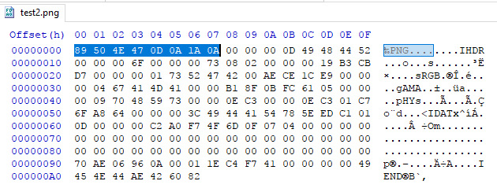
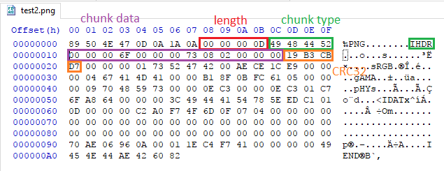
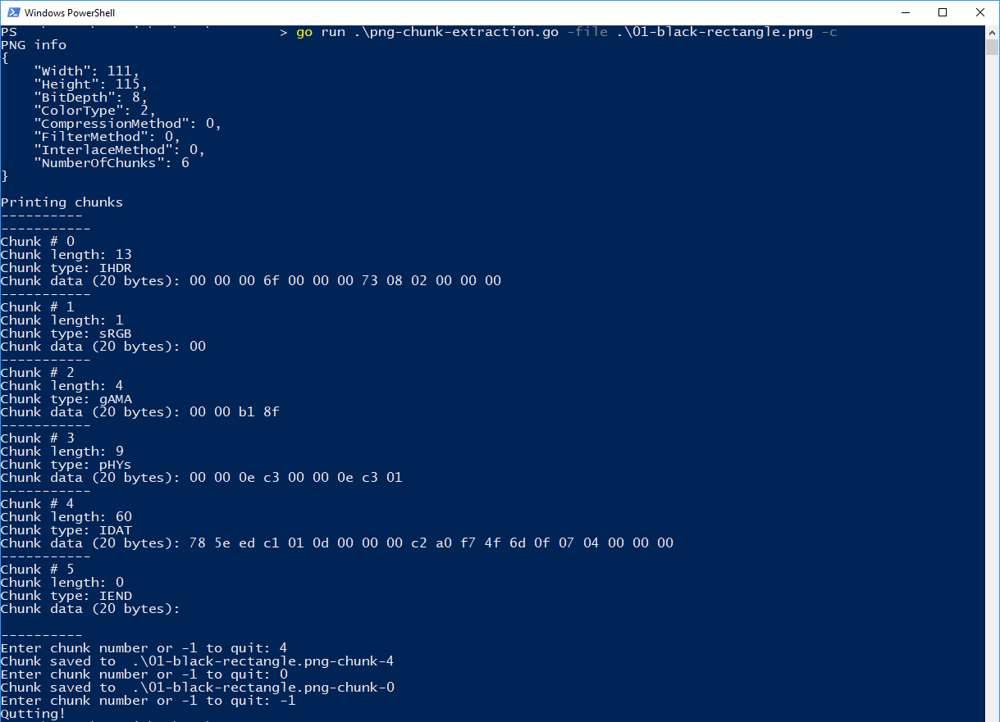

# 05.1 - Extracting PNG Chunks
This is a copy of my [blog post][png-chunk].

I wrote some quick code that parses a PNG file, extracts some information, identifies chunks and finally extracts chunk data. The code has minimal error handling (if chunks are not formatted properly). We also do not care about parsing `PLTE` and `tRNS` chunks although we will extract them.

Code is in the `05/05.1` directory.

Golang's https://golang.org/src/image/png/reader.go does a decent job of explaining the rendering. But we are not interested in rendering.

Instead we look at `libpng` documentation at http://www.libpng.org/pub/png/spec/1.2/PNG-Contents.html. I am going to use a simple example (just a black rectangle which was supposed to be a square lol) to demonstrate:


```
00000000  89 50 4e 47 0d 0a 1a 0a 00 00 00 0d 49 48 44 52  |.PNG........IHDR|
00000010  00 00 00 6f 00 00 00 73 08 02 00 00 00 19 b3 cb  |...o...s......³Ë|
00000020  d7 00 00 00 01 73 52 47 42 00 ae ce 1c e9 00 00  |×....sRGB.®Î.é..|
00000030  00 04 67 41 4d 41 00 00 b1 8f 0b fc 61 05 00 00  |..gAMA..±..üa...|
00000040  00 09 70 48 59 73 00 00 0e c3 00 00 0e c3 01 c7  |..pHYs...Ã...Ã.Ç|
00000050  6f a8 64 00 00 00 3c 49 44 41 54 78 5e ed c1 01  |o¨d...<IDATx^íÁ.|
00000060  0d 00 00 00 c2 a0 f7 4f 6d 0f 07 04 00 00 00 00  |.... ÷Om.......|
00000070  00 00 00 00 00 00 00 00 00 00 00 00 00 00 00 00  |................|
00000080  00 00 00 00 00 00 00 00 00 00 00 00 00 00 00 00  |................|
00000090  70 ae 06 96 0a 00 01 1e c4 f7 41 00 00 00 00 49  |p®......Ä÷A....I|
000000a0  45 4e 44 ae 42 60 82                             |END®B`.|
```

# PNG Header
PNG starts with an 8-byte magic header:

- `89 50 4E 47 0D 0A 1A 0A`
- `const pngHeader = "\x89PNG\r\n\x1a\n"` from https://golang.org/src/image/png/reader.go.

When you open a PNG file, you can see `PNG` in the signature.

After the signature, there are a number of chunks.



# PNG Chunks
Each chunk has [four fields][chunk-layout]:

- `unint32` length in big-endian. This is the length of the data field.
- Four-byte chunk type. Chunk type can be anything [Footnote 1].
- Chunk data is a bunch of bytes with a fixed length read before.
- Four-byte CRC-32 of Chunk 2nd and 3rd field (chunk type and chunk data).

``` go
// Each chunk starts with a uint32 length (big endian), then 4 byte name,
// then data and finally the CRC32 of the chunk data.
type Chunk struct {
    Length int    // chunk data length
    CType  string // chunk type
    Data   []byte // chunk data
    Crc32  []byte // CRC32 of chunk data
}
```

First chunk or `IHDR` looks like this:



Converting big-endian `uint32`s to int is straightforward:

``` go
// uInt32ToInt converts a 4 byte big-endian buffer to int.
func uInt32ToInt(buf []byte) (int, error) {
    if len(buf) == 0 || len(buf) > 4 {
        return 0, errors.New("invalid buffer")
    }
    return int(binary.BigEndian.Uint32(buf)), nil
}
```

**Trick #1**: When reading chunks, I did something I had not done before. I passed in an `io.Reader`. This let me pass anything that implements that interface to the method. As each chunk is populated, reader pointer moves forward and gets to the start of next chunk. Note this assumes chunks are formatted correctly and does not check the CRC32 hash.

``` go
// Populate will read bytes from the reader and populate a chunk.
func (c *Chunk) Populate(r io.Reader) error {

    // Four byte buffer.
    buf := make([]byte, 4)

    // Read first four bytes == chunk length.
    if _, err := io.ReadFull(r, buf); err != nil {
        return err
    }
    // Convert bytes to int.
    // c.length = int(binary.BigEndian.Uint32(buf))
    var err error
    c.Length, err = uInt32ToInt(buf)
    if err != nil {
        return errors.New("cannot convert length to int")
    }

    // Read second four bytes == chunk type.
    if _, err := io.ReadFull(r, buf); err != nil {
        return err
    }
    c.CType = string(buf)

    // Read chunk data.
    tmp := make([]byte, c.Length)
    if _, err := io.ReadFull(r, tmp); err != nil {
        return err
    }
    c.Data = tmp

    // Read CRC32 hash
    if _, err := io.ReadFull(r, buf); err != nil {
        return err
    }
    // We don't really care about checking the hash.
    c.Crc32 = buf

    return nil
}
```

## IHDR Chunk
IHDR is a special chunk that contains [file information][C.IHDR]. It's always 13 bytes and has:

```
// Width:              4 bytes
// Height:             4 bytes
// Bit depth:          1 byte
// Color type:         1 byte
// Compression method: 1 byte
// Filter method:      1 byte
// Interlace method:   1 byte
```

These will go directly into the `PNG` struct:

``` go
type PNG struct {
    Width             int
    Height            int
    BitDepth          int
    ColorType         int
    CompressionMethod int
    FilterMethod      int
    InterlaceMethod   int
    chunks            []*Chunk // Not exported == won't appear in JSON string.
    NumberOfChunks    int
}
```

**Trick #2**: `chunks` does not start with a capital letter. It's not exported, so it is not parsed when we convert the struct to JSON.

Parsing the header pretty easy:

``` go
// Parse IHDR chunk.
// https://golang.org/src/image/png/reader.go?#L142 is your friend.
func (png *PNG) parseIHDR(iHDR *Chunk) error {
    if iHDR.Length != iHDRlength {
        errString := fmt.Sprintf("invalid IHDR length: got %d - expected %d",
            iHDR.Length, iHDRlength)
        return errors.New(errString)
    }

    tmp := iHDR.Data
    var err error

    png.Width, err = uInt32ToInt(tmp[0:4])
    if err != nil || png.Width <= 0 {
        errString := fmt.Sprintf("invalid width in iHDR - got %x", tmp[0:4])
        return errors.New(errString)
    }

    png.Height, err = uInt32ToInt(tmp[4:8])
    if err != nil || png.Height <= 0 {
        errString := fmt.Sprintf("invalid height in iHDR - got %x", tmp[4:8])
        return errors.New(errString)
    }

    png.BitDepth = int(tmp[8])
    png.ColorType = int(tmp[9])

    // Only compression method 0 is supported
    if int(tmp[10]) != 0 {
        errString := fmt.Sprintf("invalid compression method - expected 0 - got %x",
            tmp[10])
        return errors.New(errString)
    }
    png.CompressionMethod = int(tmp[10])

    // Only filter method 0 is supported
    if int(tmp[11]) != 0 {
        errString := fmt.Sprintf("invalid filter method - expected 0 - got %x",
            tmp[11])
        return errors.New(errString)
    }
    png.FilterMethod = int(tmp[11])

    // Only interlace methods 0 and 1 are supported
    if int(tmp[12]) != 0 {
        errString := fmt.Sprintf("invalid interlace method - expected 0 or 1 - got %x",
            tmp[12])
        return errors.New(errString)
    }
    png.InterlaceMethod = int(tmp[12])

    return nil
}
```

Our example's `IHDR` is:

``` js
{
    "Width": 111,
    "Height": 115,
    "BitDepth": 8,
    "ColorType": 2,
    "CompressionMethod": 0,
    "FilterMethod": 0,
    "InterlaceMethod": 0,
    "NumberOfChunks": 6
}
```

## IDAT Chunks
IDAT chunks contain the image data. They are compressed using [deflate][png-compression]. If you look at the first chunk, you will see the `zlib` magic header. This [stackoverflow answer][stack-zlib] lists them:

- `78 01` - No Compression/low
- `78 9C` - Default Compression
- `78 DA` - Best Compression

[Another answer][stack-zlib2] has more info:

```
Level | ZLIB  | GZIP 
  1   | 78 01 | 1F 8B 
  2   | 78 5E | 1F 8B 
  3   | 78 5E | 1F 8B 
  4   | 78 5E | 1F 8B 
  5   | 78 5E | 1F 8B 
  6   | 78 9C | 1F 8B 
  7   | 78 DA | 1F 8B 
  8   | 78 DA | 1F 8B 
  9   | 78 DA | 1F 8B 
```

I have seen a lot of random looking blobs starting with `78 9C` when reversing custom protocols at work. I have never seen the other two headers.

In Go we can `inflate` the blob (decompress them) with [zlib.NewReader][zlib-newreader]:

``` js
package main

import (
    "compress/zlib"
    "io"
    "os"
)

func main() {
    zlibFile, err := os.Open("test.zlib")
    if err != nil {
        panic(err)
    }
    defer zlibFile.Close()

    r, err := zlib.NewReader(zlibFile)
    if err != nil {
        panic(err)
    }
    defer r.Close()

    outFile, err := os.Create("out-zlib")
    if err != nil {
        panic(err)
    }
    defer outFile.Close()

    io.Copy(outFile, r)
}
```

Note that each chunk is not compressed individually. All IDAT chunks need to be extracted, concatenated and decompressed together.

In our case, `IDAT` chunk has the `78 5E` header:

```
00000000  78 5e ed c1 01 0d 00 00 00 c2 a0 f7 4f 6d 0f 07  |x^íÁ..... ÷Om..|
00000010  04 00 00 00 00 00 00 00 00 00 00 00 00 00 00 00  |................|
00000020  00 00 00 00 00 00 00 00 00 00 00 00 00 00 00 00  |................|
00000030  00 00 00 00 00 70 ae 06 96 0a 00 01              |.....p®.....|
```

Everything else is straightforward after this.

# Tool Operation
Operation is pretty simple. PNG is passed by `-file`. Tool will display the PNG info like height and width. `-c` flag will display the chunks and their first 20 bytes. Chunks can be saved to file individually. Modifying the program to collect, decompress and store the IDAT chunks is also simple.



<!-- Footnotes -->
[Footnote 1]: We can hide data in random chunks. The hidden chunk must be added before/after IDAT chunks. The standard expects the chain of IDAT chunks to be uninterrupted.


<!-- Links -->

[chunk-layout]: http://www.libpng.org/pub/png/spec/1.2/PNG-Structure.html#Chunk-layout
[C.IHDR]: http://www.libpng.org/pub/png/spec/1.2/PNG-Chunks.html#C.IHDR
[png-compression]: http://www.libpng.org/pub/png/spec/1.2/PNG-Compression.html
[stack-zlib]: https://stackoverflow.com/a/17176881
[stack-zlib2]: https://stackoverflow.com/a/43170354
[zlib-newreader]: https://golang.org/pkg/compress/zlib/#NewReader
[png-chunk]: https://parsiya.net/blog/2018-02-25-extracting-png-chunks-with-go/