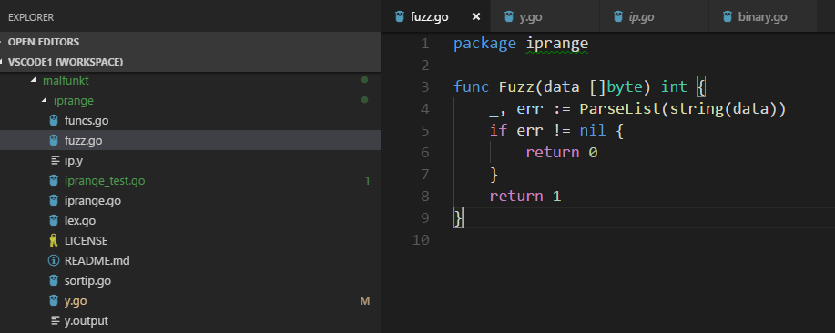
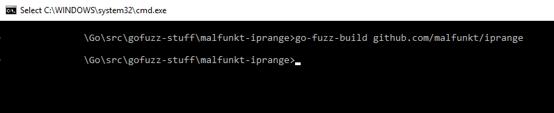
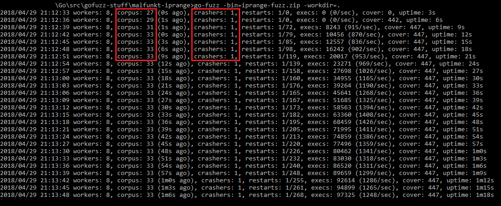

# 06.2 - Fuzzing iprange with Go-Fuzz
This article will show how to use Go-Fuzz to fuzz a Go library named `iprange` at:

- [https://github.com/malfunkt/iprange][iprange-github]

Code and fuzzing artifacts are at [code/06/06.2/](../code/06/06.2/).

# Setup
The article assumes you have a working Go installation and have `go-fuzz` and `go-fuzz-build` executables in `PATH`. If not, use the [quickstart](06.1.md) or any other tutorial to do so and return here when you are done.

# The Fuzz Function
The `Fuzz` function is the fuzzer's entry point. It's a function with the following signature:

- `func Fuzz(data []byte) int`

It takes a byte slice from the fuzzer and returns an integer. This gives us great flexibility in deciding what we want to fuzz. `Fuzz` is part of the target package so we can also fuzz package internals.

The output of `Fuzz` is our feedback to the fuzzer. If the input was valid (usually in the correct format), it should return `1` and `0` otherwise.

Having roughly correctly formatted input is important. Usually, we are dealing with formatted data. Just randomly sending byte blobs to the target is not going to do much. We want data that can bypass preliminary format checks. We pass the blob to either the target package or another function (e.g. some format converter) and check if it passes the parser check without any errors. If so, `Fuzz` must return `1` to tell `go-fuzz` that our format was good.

For a good example, look at the `PNG` fuzz function from the readme file:

``` go
func Fuzz(data []byte) int {
	img, err := png.Decode(bytes.NewReader(data))
	if err != nil {
		if img != nil {
			panic("img != nil on error")
		}
		return 0
	}
	var w bytes.Buffer
	err = png.Encode(&w, img)
	if err != nil {
		panic(err)
	}
	return 1
}
```

# Fuzzing iprange
We can use the usage section in the [iprange][iprange-github] readme to become familiar with the package.

Then we need to get the package with `go get github.com/malfunkt/iprange`. This will copy package files to `$GOPATH\src\github.com\malfunkt\iprange`.

Note: I am using commit `3a31f5ed42d2d8a1fc46f1be91fd693bdef2dd52`, if the bug gets fixed, use this specific commit to reproduce the crashes.

## Fuzz Function
Now we create a new file inside the package named `Fuzz.go` and write our fuzz function:

``` go
package iprange

func Fuzz(data []byte) int {
	_, err := ParseList(string(data))
	if err != nil {
		return 0
	}
	return 1
}
```



We are converting the input from `go-fuzz` to a string and passing it to `ParseList`. If the parser returns an error, then it's not good input and we will return `0`. If it passes the check, we return `1`. Good input will be added to the original corpus.

If `go-fuzz` achieves more coverage with a specific input, it will be added to corpus even if we return `0`. But we do not need to care about that.

## go-fuzz-build
Next step is using `go-fuzz-build` to make the magic blob. Create a directory (I always use my `src` directory`) and run this command inside it:

- `go-fuzz-build github.com/malfunkt/iprange`

Note you need to use forward slashes on Windows too. If `Fuzz` was written correctly we will get a zip file named `iprange-fuzz.zip`.

Note: This step usually takes a while. If the command line is not responsive after a few minutes, press enter a couple of times to check if it has finished. Sometimes the file is created but the command line windows is not updated.



## Corpus
To have meaningful fuzzing, we need to provide good samples. Create a directory named `corpus` inside the work directory and add one sample per file (file name does not matter).

Copy the items from [supported formats][iprange-supported] section of `iprange` readme. I created three files `test1/2/3`:

```
test1: 10.0.0.1, 10.0.0.5-10, 192.168.1.*, 192.168.10.0/24

test2: 10.0.0.1-10,10.0.0.0/24,
10.0.0.0/24

test3: 10.0.0.*, 192.168.0.*, 192.168.1-256
```

## Fuzzing
Now we can run `go-fuzz`.

- `go-fuzz -bin=iprange-fuzz.zip -workdir=.`

Note `workdir` should point to the parent of `corpus` directory.

## Fuzzing Results
We will quickly get a crash and some new files will be added to the `corpus`.



## Analyzing the Crash
While we are fuzzing, we can analyze the current crash. `go-fuzz` has created two other directories besides `corpus`.

- `suppressions` contains crash logs. This allows `go-fuzz` to skip reporting the same exact crash.
- `crashers` has our loot. Each crash has three files and the file name is `SHA-1` hash of input. In this crash we have:
    - `17ee301be06245aa20945bc3ff3c4838abe13b52` contains the input that caused the crash `0.0.0.0/40`.
    - `17ee301be06245aa20945bc3ff3c4838abe13b52.quoted` is the input but quoted as a string.
    - `17ee301be06245aa20945bc3ff3c4838abe13b52.output` contains the crash dump.

Crash dump is:

```
panic: runtime error: index out of range

goroutine 1 [running]:
encoding/binary.binary.bigEndian.Uint32(...)
	/Temp/go-fuzz-build049016974/goroot/src/encoding/binary/binary.go:111
github.com/malfunkt/iprange.(*ipParserImpl).Parse(0xc04209d800, 0x526cc0, 0xc042083040, 0x0)
	/Temp/go-fuzz-build049016974/gopath/src/github.com/malfunkt/iprange/y.go:510 +0x2be1
github.com/malfunkt/iprange.ipParse(0x526cc0, 0xc042083040, 0xa)
	/Temp/go-fuzz-build049016974/gopath/src/github.com/malfunkt/iprange/y.go:308 +0x8f
github.com/malfunkt/iprange.ParseList(0xc042075ed0, 0xa, 0xa, 0x200000, 0xc042075ed0, 0xa, 0x8)
	/Temp/go-fuzz-build049016974/gopath/src/github.com/malfunkt/iprange/y.go:63 +0xd6
github.com/malfunkt/iprange.Fuzz(0x3750000, 0xa, 0x200000, 0x3)
	/Temp/go-fuzz-build049016974/gopath/src/github.com/malfunkt/iprange/fuzz.go:4 +0x84
go-fuzz-dep.Main(0x5196e0)
	/Temp/go-fuzz-build049016974/goroot/src/go-fuzz-dep/main.go:49 +0xb4
main.main()
	/Temp/go-fuzz-build049016974/gopath/src/github.com/malfunkt/iprange/go.fuzz.main/main.go:10 +0x34
exit status 2
```

### bigEndian.Uint32
First stop is the Go standard library for `encoding/binary.binary.bigEndian.Uint32`. The source code for this method is at:

- [https://github.com/golang/go/blob/master/src/encoding/binary/binary.go#L110][bigendian-uint32]

``` go
func (bigEndian) Uint32(b []byte) uint32 {
	_ = b[3] // bounds check hint to compiler; see golang.org/issue/14808
	return uint32(b[3]) | uint32(b[2])<<8 | uint32(b[1])<<16 | uint32(b[0])<<24
}
```

Going to the issue in the comment, we land at [https://github.com/golang/go/issues/14808][issue-14808]. We can see what the bounds check is for. It's checking if the input has enough bytes and if not, it will panic before bytes are accessed. So this part of the chain is "working as intended."

This small piece of code results in a panic:

``` go
// Small program to test panic when calling Uint32(nil).
package main

import (
	"encoding/binary"
)

func main() {
	_ = binary.BigEndian.Uint32(nil)
	// _ = binary.BigEndian.Uint32([]byte(nil))
}
```

And the crash is similar to what we have seen:

```
$ go run test1.go
panic: runtime error: index out of range

goroutine 1 [running]:
encoding/binary.binary.bigEndian.Uint32(...)
        C:/Go/src/encoding/binary/binary.go:111
main.main()
        C:/Users/test-user/Go/src/gofuzz-stuff/malfunkt-iprange/test1.go:9 +0x11
exit status 2
```

### Parse
Next item in the chain is at [https://github.com/malfunkt/iprange/blob/master/y.go#L309][iprange-parse]. It's a huge method but we know the method that was called so we can just search for `Uint32`. The culprit is inside [case 5][iprange-case5].

``` go
case 5:
    ipDollar = ipS[ippt-3 : ippt+1]
    //line ip.y:54
    {
        mask := net.CIDRMask(int(ipDollar[3].num), 32)
        min := ipDollar[1].addrRange.Min.Mask(mask)
        maxInt := binary.BigEndian.Uint32([]byte(min)) + // <----
            0xffffffff -
            binary.BigEndian.Uint32([]byte(mask)) // <----
        maxBytes := make([]byte, 4)
        binary.BigEndian.PutUint32(maxBytes, maxInt)
        maxBytes = maxBytes[len(maxBytes)-4:]
        max := net.IP(maxBytes)
        ipVAL.addrRange = AddressRange{
            Min: min.To4(),
            Max: max.To4(),
        }
    }
```

We can see two calls. The first is for `min` and the second is for `mask`. `mask` comes from the output of [net.CIDRMask][godoc-net-cidrmask]. Looking at the source code, we can see that it returns `nil` if mask is not valid:

``` go
// CIDRMask returns an IPMask consisting of `ones' 1 bits
// followed by 0s up to a total length of `bits' bits.
// For a mask of this form, CIDRMask is the inverse of IPMask.Size.
func CIDRMask(ones, bits int) IPMask {
	if bits != 8*IPv4len && bits != 8*IPv6len {
		return nil
	}
	if ones < 0 || ones > bits {
		return nil
	}
    // removed
}
```

We can investigate this by modifying the local `iprange` package code and printing `ipDollar[3].num` and `mask`.

``` go
case 5:
    ipDollar = ipS[ippt-3 : ippt+1]
    //line ip.y:54
    {
        fmt.Printf("ipdollar[3]: %v\n", ipDollar[3].num) // print ipdollar[3]
        mask := net.CIDRMask(int(ipDollar[3].num), 32)
        fmt.Printf("mask: %v\n", mask)                   // print mask
        min := ipDollar[1].addrRange.Min.Mask(mask)
        fmt.Printf("min: %v\n", min)                     // print min
        maxInt := binary.BigEndian.Uint32([]byte(min)) +
            0xffffffff -
            binary.BigEndian.Uint32([]byte(mask))
        maxBytes := make([]byte, 4)
        binary.BigEndian.PutUint32(maxBytes, maxInt)
        maxBytes = maxBytes[len(maxBytes)-4:]
        max := net.IP(maxBytes)
        ipVAL.addrRange = AddressRange{
            Min: min.To4(),
            Max: max.To4(),
        }
    }
```

### Reproducing the Crash
Reproducing the crash is easy, we already have input and can just plug it into a small program using our `Fuzz` function:

``` go
// Small program to investigate a panic in iprange for invalid masks.
package main

import "github.com/malfunkt/iprange"

func main() {
	_ = Fuzz([]byte("0.0.0.0/40"))
}

func Fuzz(data []byte) int {
	_, err := iprange.ParseList(string(data))
	if err != nil {
		return 0
	}
	return 1
}
```

Note: We could write an easier test but I wanted to keep the `Fuzz` function intact.

```
$ go run test2.go
ipdollar[3]: 40
mask: <nil>
min: <nil>
panic: runtime error: index out of range

goroutine 1 [running]:
encoding/binary.binary.bigEndian.Uint32(...)
        C:/Go/src/encoding/binary/binary.go:111
github.com/malfunkt/iprange.(*ipParserImpl).Parse(0xc04209e000, 0x500920, 0xc04209c050, 0x0)
        yaccpar:354 +0x202f
github.com/malfunkt/iprange.ipParse(0x500920, 0xc04209c050, 0xa)
        yaccpar:153 +0x5f
github.com/malfunkt/iprange.ParseList(0xc042085ef8, 0xa, 0xa, 0x20, 0xc042085ef8, 0xa, 0xa)
        ip.y:93 +0xbe
main.Fuzz(0xc042085f58, 0xa, 0x20, 0xc042085f58)
        C:/Users/test-user/Go/src/gofuzz-stuff/malfunkt-iprange/test1.go:10 +0x6c
main.main()
        C:/Users/test-user/Go/src/gofuzz-stuff/malfunkt-iprange/test1.go:6 +0x69
exit status 2
```

We can see `40` is passed to `net.CIDRMask` function and the result is `nil`. That causes the crash. We can see `min` is also `nil`.

**Both min and mask are nil and result in a panic.**

## More Crashes?
I let the fuzzer run for another 20 minutes but it did not find any other crashes. Corpus was up to `60` items like:

- `2.8.0.0/4,0.0.0.5/0,2.8.0.0/4,0.0.0.5/0,2.8.0.0/4,0.0.0.5/0`
- `0.0.0.0/4,0.0.0.5-0,2.8.1.*,2.8.0.0/2`

## Solution
Just pointing out bugs is not useful. Being a security engineer is not just finding vulnerabilities.

The quick solution is checking the values of `min` and `mask` before calling `Uint32`.

A better solution is to check the input for validity and good format before processing. For example, for IPv4 masks we can check if they are in the `16-30` range.

#### Continue reading ⇒ [06.3 - Fuzzing goexif2 Go-Fuzz](06.3.md)

<!-- Links -->
[go-fuzz]: https://github.com/dvyukov/go-fuzz
[iprange-github]: https://github.com/malfunkt/iprange
[iprange-supported]: https://github.com/malfunkt/iprange#supported-formats
[bigendian-uint32]: https://github.com/golang/go/blob/master/src/encoding/binary/binary.go#L110
[issue-14808]: https://github.com/golang/go/issues/14808
[iprange-parse]: https://github.com/malfunkt/iprange/blob/master/y.go#L309
[iprange-case5]: https://github.com/malfunkt/iprange/blob/master/y.go#L498
[godoc-net-cidrmask]: https://golang.org/pkg/net/#CIDRMask
[net-cidrmask-github]: https://github.com/golang/go/blob/master/src/net/ip.go#L68
