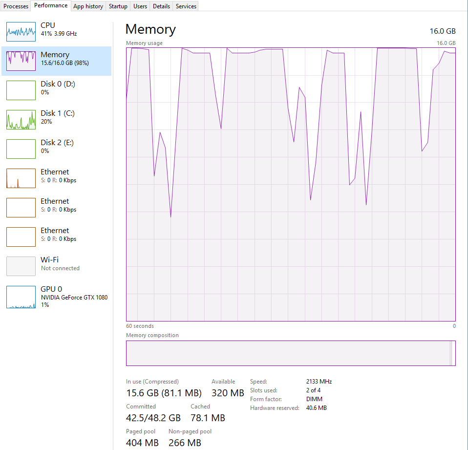
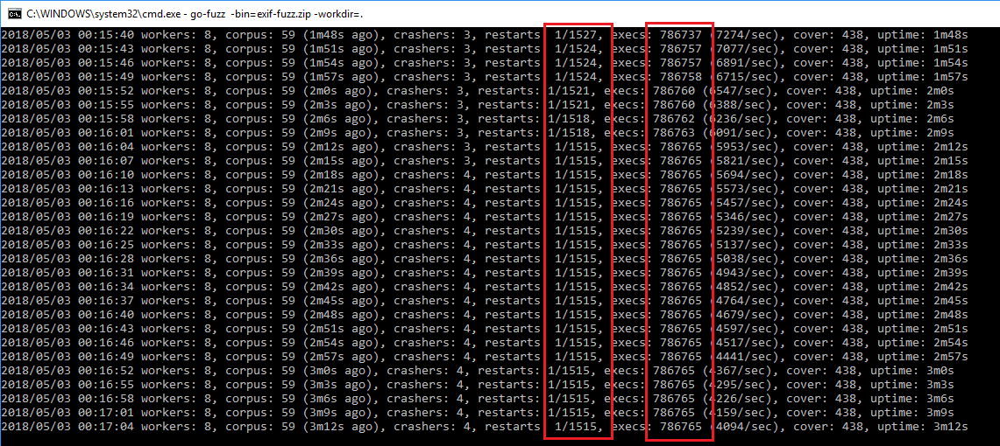

# 06.3 - Fuzzing goexif2 with Go-Fuzz
This time we will be looking After `goexif` at [https://github.com/rwcarlsen/goexif][goexif-github]. Being a file parser, it's a prime target for `Go-Fuzz`. Unfortunately it has not been updated for a while. Instead, we will be looking at a fork at [https://github.com/xor-gate/goexif2][goexif2-github].

Code and fuzzing artifacts are at [code/06/06.3/](../code/06/06.3/).

# TL;DR
Steps are similar to the previous part.

1. `go get github.com/xor-gate/goexif2/exif`
2. `go get github.com/xor-gate/goexif2/tiff`
3. Create `Fuzz.go`.
4. Build with `go-fuzz-build`.
	* `go-fuzz-build github.com/xor-gate/goexif2/exif`
5. Fuzz
6. ???
7. Crashes!

If panics have been fixed, you can clone the commit `e5a111b2b4bd00d5214b1030deb301780110358d`. 

# Fuzz
The `Fuzz` function is easy straight forward:

``` go
// +build gofuzz

package exif

import "bytes"

func Fuzz(data []byte) int {
	_, err := Decode(bytes.NewReader(data))
	if err != nil {
		return 0
	}
	return 1
}
```

# Samples
For samples, we need some pictures that contain exif data. The package comes with some samples inside the `samples` directory but I used samples at the following repository minus `corrupted.jpg`:

- https://github.com/ianare/exif-samples/tree/master/jpg

# Running Out of Memory
During fuzzing I got a lot of crashes that were caused by lack of memory. This usually happens when random bytes are read as field sizes and the size is not evaluated, thus the package will allocate very large chunks of memory.

We are instrumenting the application around 10000 times a second, this adds up and the garbage collector cannot keep up. Soon we need to `download more RAM`. You can see memory usage in the following picture:



Looking at the fuzzer, we can see our `restarts` ratio is crap. This is the ratio of restarts to executions. We want it to be around `1/10000` but we have fallen to `1/1500`. This means we are crashing a lot. After a while, `Go-Fuzz` might even stop working (see stagnating total number of execs in the picture below).



Looking inside crash dumps, we see most of them are about running out of memory:

```
runtime: out of memory: cannot allocate 25769803776-byte block (25832882176 in use)
fatal error: out of memory

runtime stack:
runtime.throw(0x547da6, 0xd)
	/go-fuzz-build214414686/goroot/src/runtime/panic.go:616 +0x88
runtime.largeAlloc(0x600000000, 0x440001, 0x5f8330)
	/go-fuzz-build214414686/goroot/src/runtime/malloc.go:828 +0x117
runtime.mallocgc.func1()
	/go-fuzz-build214414686/goroot/src/runtime/malloc.go:721 +0x4d
runtime.systemstack(0x0)
	/go-fuzz-build214414686/goroot/src/runtime/asm_amd64.s:409 +0x7e
runtime.mstart()
	/go-fuzz-build214414686/goroot/src/runtime/proc.go:1175
```

This means we are running out of memory and it's not a legitimate crash. Before continuing we need to go and investigate the root cause.

**Lesson #0:** Fix `Go-Fuzz` running out of memory:

* Fix bugs that result in the allocation of large chunks of memory.
* Run fewer workers with `-procs`. By default `Go-Fuzz` uses all of your CPU cores (including virtual).

# Analyzing Crashes
Let's look at our crashes.

```
05/03/2018  12:16 AM               365 171e8e5ca3e3d609322376915dcfa3dd56938845
05/03/2018  12:16 AM             3,651 171e8e5ca3e3d609322376915dcfa3dd56938845.output
05/03/2018  12:16 AM               912 171e8e5ca3e3d609322376915dcfa3dd56938845.quoted
05/01/2018  11:53 PM               186 3f5b7d448a0791f5739fa0a2371bb2492b64f835
05/01/2018  11:53 PM             1,928 3f5b7d448a0791f5739fa0a2371bb2492b64f835.output
05/01/2018  11:53 PM               312 3f5b7d448a0791f5739fa0a2371bb2492b64f835.quoted
05/01/2018  11:25 PM               114 49dfc363adbbe5aac9c2f8afbb0591c3ef1de2c3
05/01/2018  11:25 PM             1,383 49dfc363adbbe5aac9c2f8afbb0591c3ef1de2c3.output
05/01/2018  11:25 PM               186 49dfc363adbbe5aac9c2f8afbb0591c3ef1de2c3.quoted
05/01/2018  11:26 PM                22 a59a2ad5701156b88c6a132e1340fe006f67280c
05/01/2018  11:26 PM             1,677 a59a2ad5701156b88c6a132e1340fe006f67280c.output
05/01/2018  11:26 PM                63 a59a2ad5701156b88c6a132e1340fe006f67280c.quoted
```

## Reproducing Crashes
As we know `Go-Fuzz` conveniently stores the inputs in files. We can use the following code snippet to reproduce crashes:

``` go
// Sample app to test crash a5 for xor-gate/goexif2.
package main

import (
	"fmt"
	"os"

	"github.com/xor-gate/goexif2/exif"
)

func main() {
	f, err := os.Open("crashers\\a59a2ad5701156b88c6a132e1340fe006f67280c")
	if err != nil {
		panic(err)
	}
	defer f.Close()

	_, err = exif.Decode(f)
	if err != nil {
		fmt.Println("err:", err)
		return
	}
	fmt.Println("no err")
}
```

## A5 and 3F Crashes
These two panics are similar:

```
panic: runtime error: makeslice: len out of range

goroutine 1 [running]:
github.com/xor-gate/goexif2/tiff.(*Tag).convertVals(0xc04205a280, 0xc042080480, 0xc04200e090)
	/go-fuzz-build214414686/gopath/src/github.com/xor-gate/goexif2/tiff/tag.go:258 +0x88c
github.com/xor-gate/goexif2/tiff.DecodeTag(0x30a0000, 0xc042080480, 0x5605c0, 0x613170, 0x514c20, 0xc04200e06c, 0x0)
	/go-fuzz-build214414686/gopath/src/github.com/xor-gate/goexif2/tiff/tag.go:182 +0x623
github.com/xor-gate/goexif2/tiff.DecodeDir(0x30a0000, 0xc042080480, 0x5605c0, 0x613170, 0xc042080480, 0x0, 0x0, 0x0)

// removed
```

`A5` crash payload is:

```
00000000  49 49 2a 00 08 00 00 00 30 30 30 30 05 00 00 00  |II*.....0000....|
00000010  00 a0 30 30 30 30                                |. 0000|
```

The panic is happening at https://github.com/xor-gate/goexif2/blob/develop/tiff/tag.go#L258:

``` go
case DTRational:
	t.ratVals = make([][]int64, int(t.Count))
	for i := range t.ratVals {
```


We can add some print statements to the local copy the package and investigate it:

``` go
case DTRational:
	fmt.Println("t.count: ", t.Count)
	t.ratVals = make([][]int64, int(t.Count))
	for i := range t.ratVals {
```

Running `test-crash-a5.go` we get the value:

```
$ go run test-crash-a5.go
t.count:  2684354560
panic: runtime error: makeslice: len out of range

goroutine 1 [running]:
github.com/xor-gate/goexif2/tiff.(*Tag).convertVals(0xc04205a1e0, 0xc042082018, 0xc042062110)
```

### Bonus: int Overflow and Go Playground's Operating System
As you have noticed, the constant `2684354560` is more than the maximum of signed int32 (`2147483647`). However, when trying to cast this value locally in Windows 10 64-bit VM or on the Go playground we get different results.

Consider this mini-example:

``` go
// Testing overflow on int.
package main

import "fmt"

func main() {
	i := int(2684354560)
	fmt.Println(i)
}
```

Running this in the Windows 10 64-bit VM, does not return an error. While running the same program in Go playground returns this error `prog.go:8:11: constant 2684354560 overflows int32`.

This means the playground is using 32 bit `int`s and locally we are using 64 bit ones. Local is obvious because we are in a 64 bit OS. To get the OS of the Go playground we can use this other small program:

``` go
// Get OS and architecture.
package main

import (
	"fmt"
	"runtime"
)

func main() {
	fmt.Println(runtime.GOOS)
	fmt.Println(runtime.GOARCH)
}
```


And we get:

```
nacl
amd64p32
```

`amd64p32` means it's a 64-bit OS using 32-bit pointers and `int`s. We can use `unsafe.Sizeof` to see this.

``` go
// Get int and pointer size.
package main

import (
	"fmt"
	"unsafe"
)

func main() {
	var i int
	var p *int
	var p2 *float32

	fmt.Printf("Size of int      : %d\n", unsafe.Sizeof(i))
	fmt.Printf("Size of *int     : %d\n", unsafe.Sizeof(p))
	fmt.Printf("Size of *float32 : %d\n", unsafe.Sizeof(p2))
}
```

On Go playground we get:

```
Size of int      : 4
Size of *int     : 4
Size of *float32 : 4
```

But locally we get:

```
$ go run int-pointer-size.go
Size of int : 8
Size of int*: 8
Size of *float32 : 8
```

**Note:** Pointers are just memory addresses. It does not matter what they are pointing to. As you can see`*float32` has the same size as a `*int32` or `*int64`.

**Lesson #1:** `int` is OS dependent. It's better to use data types with explicit lengths like `int32` and `int64`. Also if you do not need negative numbers, use unsigned versions (but be careful of underflows).

### makeslice: len out of range
Now let's get back to the crash. We are trying to create a large slice and the result is an error. We can trace back this error to [slice.go][go-slice-makeslice] in Go source:

``` go
func makeslice(et *_type, len, cap int) slice {
	// NOTE: The len > maxElements check here is not strictly necessary,
	// but it produces a 'len out of range' error instead of a 'cap out of range' error
	// when someone does make([]T, bignumber). 'cap out of range' is true too,
	// but since the cap is only being supplied implicitly, saying len is clearer.
	// See issue 4085.
	maxElements := maxSliceCap(et.size)
	if len < 0 || uintptr(len) > maxElements {
		panic(errorString("makeslice: len out of range"))
	}

	if cap < len || uintptr(cap) > maxElements {
		panic(errorString("makeslice: cap out of range"))
	}

	p := mallocgc(et.size*uintptr(cap), et, true)
	return slice{p, len, cap}
}

// maxSliceCap from the same file.
// maxSliceCap returns the maximum capacity for a slice.
func maxSliceCap(elemsize uintptr) uintptr {
	if elemsize < uintptr(len(maxElems)) {
		return maxElems[elemsize]
	}
	return _MaxMem / elemsize
}
```

`_MaxMem` is calculated in [malloc.go][go-malloc-maxmem] and it dictates how much memory can be allocated. On Windows 64-bit it seems to be 32GB or 35 bits.

**Root cause analysis:** We are allocating too much memory.

**Lesson #2:** Amount of memory available for malloc is OS dependent and somewhat arbitrary.

**Lesson #3:** Manually check size before allocating memory for slices.

But `t.Count` has to come from somewhere.

### t.Count's Origin
`t.Count` is calculated a bit further up at [line 133][exif2-tag-decodetag].

``` go
err = binary.Read(r, order, &t.Count)
if err != nil {
	return nil, newTiffError("tag component count read failed", err)
}

// There seems to be a relatively common corrupt tag which has a Count of
// MaxUint32. This is probably not a valid value, so return early.
if t.Count == 1<<32-1 {
	return t, newTiffError("invalid Count offset in tag", nil)
}
```

We are reading 4 bytes (`Count` is `uint32`) and populating `t.Count`. According to [RFC2306 - Tag Image File Format (TIFF) - F Profile for Facsimile][rfc2306]:

> TIFF fields (also called entries) contain a tag, its type (e.g. short, long, rational, etc.), a count (which indicates the number of values/offsets) and a value/offset.

So we get `2684354560` when we read `A0 00 00 00` from our payload in little-endian:

```
00000000  49 49 2a 00 08 00 00 00 30 30 30 30 05 00 00 00  |II*.....0000....|
00000010  00 a0 30 30 30 30                                |. 0000|
```

**Lesson #4:** After reading data, check them for validity. This is more important for field lengths.

### Fix A5 and 3F Crashes
I could not find anything about the maximum number of types in a tag in the RFC. But it's a `dword` (4 bytes) so it can contain values that cause the panic in `makeslice`. We can choose a large enough value that does not cause the panic. I think `2147483647` or `1<<31-1` is a good compromise.

We can add our new check to the current check:

``` go
// There seems to be a relatively common corrupt tag which has a Count of
// MaxUint32. This is probably not a valid value, so return early.
// Also check for invalid count values.
if t.Count == 1<<32-1 || t.Count >= 1<<31-1 {
	return t, newTiffError("invalid Count offset in tag", nil)
}
```

Now both crashes are avoided:

```
$ go run test-crash-a5.go
err: exif: decode failed (tiff: invalid Count offset in tag)

$ go run test-crash-3f.go
err: loading EXIF sub-IFD: exif: sub-IFD ExifIFDPointer decode failed: tiff: invalid Count offset in tag
```

## 49 Crash
This crash payload is:

```
00000000  4d 4d 00 2a 00 00 00 08 00 07 30 30 30 30 30 30  |MM.*......000000|
00000010  30 30 30 30 30 30 30 30 30 30 30 30 30 30 30 30  |0000000000000000|
00000020  30 30 30 30 30 30 30 30 30 30 30 30 30 30 30 30  |0000000000000000|
00000030  30 30 30 30 30 30 30 30 30 30 87 69 00 04 00 00  |0000000000.i....|
00000040  00 00 30 30 30 30 30 30 30 30 30 30 30 30 30 30  |..00000000000000|
00000050  30 30 30 30 30 30 30 30 30 30 30 30 30 30 30 30  |0000000000000000|
00000060  30 30 30 30 30 30 30 30 30 30 30 30 30 30 30 30  |0000000000000000|
00000070  30 30                                            |00|
```

And results in:

```
panic: runtime error: index out of range

goroutine 1 [running]:
github.com/xor-gate/goexif2/tiff.(*Tag).Int64(...)
	go-fuzz-build214414686/gopath/src/github.com/xor-gate/goexif2/tiff/tag.go:363
github.com/xor-gate/goexif2/exif.loadSubDir(0xc042080510, 0x547f15, 0xe, 0xc042080390, 0xc042080540, 0xc042089d68)
	go-fuzz-build214414686/gopath/src/github.com/xor-gate/goexif2/exif/exif.go:211 +0x704
github.com/xor-gate/goexif2/exif.(*parser).Parse(0x613170, 0xc042080510, 0xc0420804b0, 0x0)
	go-fuzz-build214414686/gopath/src/github.com/xor-gate/goexif2/exif/exif.go:190 +0x174
github.com/xor-gate/goexif2/exif.Decode(0x560240, 0xc042080480, 0x5ae92f8f, 0x212abedc, 0x1e9999)
	go-fuzz-build214414686/gopath/src/github.com/xor-gate/goexif2/exif/exif.go:331 +0x503
github.com/xor-gate/goexif2/exif.Fuzz(0x38f0000, 0x72, 0x200000, 0xc042047f48)
	go-fuzz-build214414686/gopath/src/github.com/xor-gate/goexif2/exif/Fuzz.go:8 +0xba
go-fuzz-dep.Main(0x550580)
	go-fuzz-build214414686/goroot/src/go-fuzz-dep/main.go:49 +0xb4
main.main()
	go-fuzz-build214414686/gopath/src/github.com/xor-gate/goexif2/exif/go.fuzz.main/main.go:10 +0x34
exit status 2
```

This can be reproduced by running `test-crash-49.go`. At this point we know the drill. Looking at [tag.go:363][exif2-tag-357]:

``` go
// Int64 returns the tag's i'th value as an integer. It returns an error if the
// tag's Format is not IntVal. It panics if i is out of range.
func (t *Tag) Int64(i int) (int64, error) {
	if t.format != IntVal {
		return 0, t.typeErr(IntVal)
	}
	return t.intVals[i], nil
}
```

It's known that this method can panic. We need to modify it (and the other similar ones) to return an error instead.

### Fix 49 Crash
The fix is straightforward. Before accessing `t.intVals[i]` we need to check if the index is valid. This can be accomplished by checking it against `len(t.intVals[i])`.

``` go
// Int64 returns the tag's i'th value as an integer. It returns an error if the
// tag's Format is not IntVal. It panics if i is out of range.
func (t *Tag) Int64(i int) (int64, error) {
	if t.format != IntVal {
		return 0, t.typeErr(IntVal)
	}
	if i >= len(t.intVals) {
		return 0, newTiffError("index out of range in intVals", nil)
	}
	return t.intVals[i], nil
}
```

**Lesson #5:** Check index against array length before access.

Now we do not panic but there's no error because it's suppressed at [exif.go:211][exif2-exif-211]:

``` go
func loadSubDir(x *Exif, ptr FieldName, fieldMap map[uint16]FieldName) error {
	tag, err := x.Get(ptr)
	if err != nil {
		return nil
	}
	offset, err := tag.Int64(0)
	if err != nil { 	// error is suppressed here
		return nil
	}
	// removed
```

The new error check needs to be added to these methods:

* `Rat2`
* `Int64`
* `Int`
* `Float`

A bit further down inside the `MarshalJSON` method we can see errors being ignored:

``` go
// removed
for i := 0; i < int(t.Count); i++ {
	switch t.format {
	case RatVal:
		n, d, _ := t.Rat2(i)
		rv = append(rv, fmt.Sprintf(`"%v/%v"`, n, d))
	case FloatVal:
		v, _ := t.Float(i)
		rv = append(rv, fmt.Sprintf("%v", v))
	case IntVal:
		v, _ := t.Int(i)
		rv = append(rv, fmt.Sprintf("%v", v))
	}
}
// removed
```

Looking at the function we can see by ignoring the errors, we will have garbage data in the JSON. However, I don't think we need to return errors here but I could be wrong.

# Adding Crashes to Tests
After things are fixed, we need to add the crashes to tests. This will discover if these bug regress in the future. Unfortunately, the package uses `go generate` to generate tests and I have no clue how to use it. But I know how to write normal Go test using the [testing][go-testing] package. Our payloads are pretty small so we will embed them in the test file instead of adding extra files to the package.

``` go
package exif

import (
	"bytes"
	"fmt"
	"os"
	"testing"
)

var goFuzzPayloads = make(map[string]string)

// Populate payloads.
func populatePayloads() {

	goFuzzPayloads["3F"] = "II*\x00\b\x00\x00\x00\t\x000000000000" +
		"00000000000000000000" +
		"00000000000000000000" +
		"00000000000000000000" +
		"00000000000000000000" +
		"000000i\x87\x04\x00\x01\x00\x00\x00\xac\x00\x00\x0000" +
		"00000000000000000000" +
		"00000000000000000000" +
		"0000000000000000\x05\x00\x00\x00" +
		"\x00\xe00000"

	goFuzzPayloads["49"] = "MM\x00*\x00\x00\x00\b\x00\a0000000000" +
		"00000000000000000000" +
		"000000000000000000\x87i" +
		"\x00\x04\x00\x00\x00\x0000000000000000" +
		"00000000000000000000" +
		"00000000000000"

	goFuzzPayloads["A5"] = "II*\x00\b\x00\x00\x000000\x05\x00\x00\x00\x00\xa000" +
		"00"

}

// Test for Go-fuzz crashes.
func TestGoFuzzCrashes(t *testing.T) {
	for k, v := range goFuzzPayloads {
		t.Log("Testing gofuzz payload", k)
		v, err := Decode(bytes.NewReader([]byte(v)))
		t.Log("Results:", v, err)
	}
}

func TestMain(m *testing.M) {
	populatePayloads()
	ret := m.Run()
	os.Exit(ret)
}
```

**Lesson #6:** Add `Go-Fuzz` crashes to unit tests. This is useful for regression testing.

## Lessons Learned

* `Go-Fuzz` can crash when running out of memory and return false positives. We can throttle it or fix memory allocation bugs before resuming.
* Use data types with explicit lengths such as `int32` and `int64` instead of OS dependent ones like `int`.
* Amount of memory available for malloc is OS dependent and somewhat arbitrary.
* Manually check the size before allocating memory for slices.
* Check data (esp. field lengths) for validity after reading them.
* Check index against array length before access.
* Add `Go-Fuzz` crashes to unit tests.

<!-- Links -->

[go-slice-makeslice]: https://golang.org/src/runtime/slice.go#L24
[go-malloc-maxmem]: https://golang.org/src/runtime/malloc.go#L137
[exif2-tag-decodetag]: https://github.com/xor-gate/goexif2/blob/develop/tiff/tag.go#L133
[rfc2306]: https://tools.ietf.org/html/rfc2306
[exif2-tag-357]: https://github.com/xor-gate/goexif2/blob/develop/tiff/tag.go#L357
[exif2-exif-211]: https://github.com/xor-gate/goexif2/blob/develop/exif/exif.go#L211
[go-testing]: https://golang.org/pkg/testing/
[goexif2-gosecurity]: https://github.com/parsiya/Go-Security/tree/master/go-fuzz/goexif2
[goexif-github]: https://github.com/rwcarlsen/goexif
[goexif2-github]: https://github.com/xor-gate/goexif2